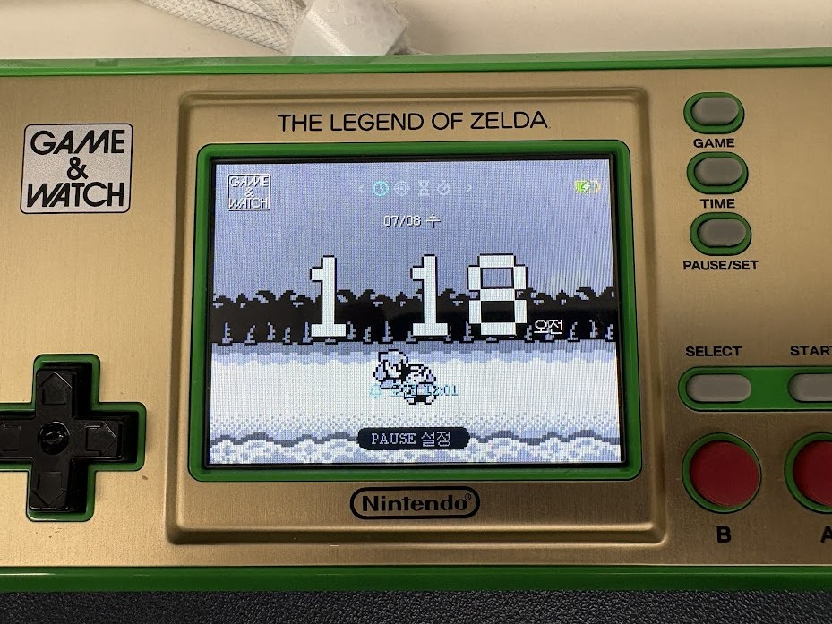

# 🧪 Experimental Lab Fork ⚠️ — read before flashing

<p align="center">
  
  <br>
  <em>The built-in Clock app — pixel-scene background, on real hardware.</em>
</p>

<p align="center">
  <strong>📖 Full documentation &amp; devlog →
  <a href="https://jshsakura.github.io/game-and-watch-retro-go-sd/">jshsakura.github.io/game-and-watch-retro-go-sd</a></strong>
  <br>
  <sub>Browsable docs, per-system deep dives, and a dated development journal. This README is the short version.</sub>
</p>

This is a **personal experimental lab** built on top of
[sylverb/game-and-watch-retro-go-sd](https://github.com/sylverb/game-and-watch-retro-go-sd),
the excellent SD-card fork of retro-go for the Nintendo® Game & Watch™. Everything here
stands on that project — **if you just want to play games, use sylverb's stable build**;
this repository is where I try things first. Fixes are made with affection for these
little machines, in the hope that a small part of it can flow back upstream someday.

The integration branch is **`testbed`** (this repo's default) — release builds are cut
from it as `testbed-full-*` tags on the
[releases page](https://github.com/jshsakura/game-and-watch-retro-go-sd/releases).

> **This README documents only what this fork adds or changes.** Everything else — the
> hardware mod, installation, controls, per-emulator notes for the stock systems, the FAQ
> — lives in the [upstream README](https://github.com/sylverb/game-and-watch-retro-go-sd)
> and applies here unchanged. See [Full documentation → upstream](#-full-documentation--upstream).

---

## Additional to the upstream firmware

This fork is the **same upstream firmware, plus a grab-bag of extra experimental features I
added to my own taste.** It's rough around the edges and a bit of a mess — this is a personal
lab, not a "better" build, and nothing here is meant to replace sylverb's. It only *adds* on
top, for anyone who wants to try the experiments.

There is no in-app "labs" switch: **the experimental firmware is simply a different firmware.**
Both this fork and upstream install the same way (`retro-go_update.bin` on the SD root) and
share your ROMs and SD layout, so you can move between them freely:

- For the **stable base**, flash sylverb's `retro-go_update.bin`.
- To try the **experimental additions**, flash this fork's `retro-go_update.bin`
  (`testbed-full-*` from the [releases page](https://github.com/jshsakura/game-and-watch-retro-go-sd/releases)).

Only savestates may differ between the two, so keep a backup. (The companion asset tool,
[game-and-what](#-companion-game-and-what), is a separate web app controlled by its own env
configuration — it's not part of the firmware you flash.)

---

## Supported systems

🧪 = added or enabled by this Lab fork · everything else is upstream and documented there.

| System | Emulator / port | Origin | Notes |
| --- | --- | --- | --- |
| **Game Boy Advance** | gpSP | 🧪 Lab | Pokémon Ruby & Emerald **full speed**; heavier titles vary. ROM stays in flash (never in RAM). [Details](#game-boy-advance) |
| **PC Engine CD** | pce-go + CD | 🧪 Lab | CD-DA, ADPCM, BRAM saves, savestate/resume. `/roms/pcecd/<game>/`. 4 playthroughs verified |
| **Atari Lynx** | handy | 🧪 Lab | in-game save/load + resume; 512K carts run from flash when RAM is tight |
| **WonderSwan / Color** | oswan | 🧪 Lab | 8 MB carts (One Piece), sound-DMA boot hang fixed, FIT-scaling fixed |
| **Neo Geo Pocket / Color** | RACE | 🧪 Lab | runs from flash, flicker/scaling fixes, sound resumes after loading a state |
| **Virtual Boy** | red-viper | 🧪 Lab | ⚠️ **~65-70% speed** with auto-overclock; gapless audio, selectable pad presets |
| **Commodore 64** | Frodo | 🧪 Lab | `.d64` autostart (LOAD/RUN + warp), both joystick ports, pause/exit menu |
| **ZX Spectrum** | floooh's chips | 🧪 Lab | BIOS from SD, auto-fit screen, configurable GAME/TIME/B mapping |
| **game.com** | Tiger | 🧪 Lab | plays the library; 4-action pad mapped onto G&W buttons |
| **Odyssey² / Videopac** | O2EM | 🧪 Lab (enabled) | raw-ROM path fixed; save/load/resume; multi-game cart select |
| **Super Metroid** | snesrev/sm port | 🧪 Lab | native C reimplementation, 60 fps, savestates. [Details](#super-metroid) |
| **Sega 32X** | PicoDrive | 🧪 Lab | ⚠️ **experimental / in progress** — SD builds only, `/roms/32x` |
| Tamagotchi | TamaLib | Upstream (P2 🧪) | P1 upstream; P2 experimental in this fork |
| NES, Game Boy / Color, Master System, Game Gear, Genesis, SG-1000 | fceumm / gnuboy / smsplusgx / gwenesis | Upstream | see upstream docs |
| MSX 1/2/2+, Amstrad CPC6128 | blueMSX / caprice32 | Upstream | preview-quality; see upstream docs |
| PC Engine / TG-16, ColecoVision | pce-go / smsplusgx | Upstream | see upstream docs |
| Atari 2600 / 7800, Watara Supervision, Pokémon Mini | stella / prosystem / potator / PokeMini | Upstream | see upstream docs |
| Game & Watch / LCD Games | LCD-Game-Emulator | Upstream | `.gw` files |
| SNES: Zelda 3, Super Mario World | homebrew C ports | Upstream | asset-file build; see upstream docs |
| Celeste Classic | Pico-8 port | Upstream | see upstream docs |
| Pico-8 | macs75 engine | Upstream | separate package install; see upstream docs |

### BIOS files the added systems expect

| System | SD path | Files |
| --- | --- | --- |
| PC Engine CD | `/bios/pce/` | `syscard3.pce` (Super CD-ROM² System Card 3.0; `syscard3.bin` also accepted) |
| ZX Spectrum | `/bios/zxs/` | `48.rom` |
| Commodore 64 | `/bios/c64/` | `kernal.bin`, `basic.bin`, `chargen.bin` |
| Odyssey² / Videopac | `/bios/videopac/` | `o2rom.bin` |
| game.com | `/bios/gamecom/` | `internal.bin`, `external.bin` |

Atari Lynx, WonderSwan, Neo Geo Pocket, Virtual Boy and Game Boy Advance need no BIOS files.

---

## What this fork adds

### Apps (homebrew overlays)

| App | What it does |
| --- | --- |
| **Music player (MP3)** | minimp3 streaming, album art (HW JPEG + PNG, correct colours), ID3 tags, seek; keeps playing across sleep and while browsing |
| **Video player (MJPEG-AVI)** | faster SD reads, sleep recovery, jitter-buffer read-ahead; companion encoder VBV-caps heavy scenes |
| **Clock** | full clock suite — see [below](#clock-time-menu--clock) |
| **TamaPoke** | virtual-pet game; 7 UI languages, Korean added by this fork — see [below](#tamapoke-homebrew) |

### Clock (TIME menu → Clock)

A full-screen clock app benchmarked on the Game & Watch alarm clock, drawn entirely in code
so nothing copyrighted ships.

| Aspect | What |
| --- | --- |
| Modes | Clock · Pomodoro · countdown Timer · Stopwatch (shared layout — `A` start/pause, `B` reset, `PAUSE` = settings incl. Exit) |
| Look | 7-segment / pixel / dot faces × **8 colour themes**; real G&W logo, mode-icon pager, `<>` chevrons, battery, DND moon, localized date/weekday, AM/PM |
| Alarms | set on a full-screen clone of the clock face (edited field blinks); **snooze** (ring → `A` = +5 min, anything else = stop); synthesised beep at system volume; localized |
| Background | off / ambient / built-in pixel scene / animated GIF (`/clock/gif/bg.gif`, must be **320×240**, decoded a frame at a time to RGB565 from the emulator-RAM pool, borrowed and released) |
| Assets | GIFs & icons prepared by the companion **[game-and-what](#-companion-game-and-what)** tool (`encode_to_clock_gif`: palette-optimized, dithered for RGB565) |
| Config / dev | config in `/clock/clock.cfg`; `host/clock_preview.c` renders pixel-exact PNGs for design review; `tests/` has host unit tests for the alarm logic and GIF pipeline |

### Launcher

| Change | What |
| --- | --- |
| **System-grid home** | all 28 systems on a 6×3 page of rounded tiles (reuses the tab icons — 0 extra resident RAM). Worst case 8 presses to any system instead of 28. Hold `LEFT`/`RIGHT` past the tabs, or `B` from a list; `A` opens. Cold boot → grid, return-from-game → the list you launched from |
| **Favorites tab (★)** | plain-text `/favorites.txt` shown first; 0 resident RAM (shared list buffer). Toggle from the A-button menu; mixed-system covers letterbox into one poster slot |
| **Wordmarks & icons** | per-system name headers in one font/size, 28×28 colour tab icons. NES → `NES (FAMICOM)`, MSX → `MSX / MSX2+` |
| **Carousel wrap** | single-screen lists no longer repeat to fill the view; only multi-page lists connect end-to-start |
| **i18n** | added strings translated across the 12 supported languages; older SD language bins stay compatible |

### System-wide

| Change | What |
| --- | --- |
| **Game caching speed** | ROM flash cache erases with the chip's largest erase command instead of per-4KB; "Caching game" is several times shorter. Fixed a 256KB-sector buffer overflow and a missed erased-tail invalidation along the way |
| **Blit speed** | framebuffer MPU regions are Normal non-cacheable, saving ~1.4-2.1 ms per full-screen blit on every system, with explicit ordering guards |
| **Battery gauge** | filter state persists across power-off in an RTC backup register, with a display limiter and a sleep-entry reference — no seesaw between boots, no stale value after charging asleep |
| **Idle auto-sleep** | an untouched game sleeps the device instead of draining the battery |
| **Sleep recovery** | SD file handles (music, video, PCE-CD) self-heal after the card is power-cycled by sleep |
| **Boot-loop rescue** | watchdog armed from the first line of `main()`; two consecutive failed boots stop the third at a **rescue screen** (boot-to-menu / normal boot / power off) *before* SD, config or auto-resume are touched. POWER on the crash screen really powers off. `TIME` at power-on still skips auto-resume |

### Korean text in the homebrew games

| Game | How Korean is provided |
| --- | --- |
| **Zelda 3** | a `ko` entry in the language menu, from the ZELDA3_K fan translation; full 16×16 glyphs rendered variable-width so syllables come out complete. Needs a `zelda3_assets.dat` built with `--languages ko` (dat + overlay + firmware are a matched set) |
| **Super Mario World** | the level message-box font swaps to Korean through an ExGFX slot, uploaded before and restored after each message |
| **Super Metroid** | the port reads the ROM you supply — a fan-patched ROM's second language (Korean) is selectable from Options. The patch has no 65816 code; the fix was reading 14 text-table pointers back out of the ROM |

Translation data itself is **not** distributed here.

---

## Build-time feature flags (env)

Beyond choosing which firmware to flash, what gets *compiled in* is controlled by make/env
flags. The canonical release set (from `.github/workflows/package.yml`) is:

```bash
make release DOCKER=1 COVERFLOW=1 SHARED_HIBERNATE_SAVESTATE=1 DISABLE_SPLASH_SCREEN=1 \
             ENABLE_BOOT_OC=1 INTFLASH_BANK=2 CHEAT_CODES=1 ZH_CN=1 ZH_TW=1 KO_KR=1 JA_JP=1
```

| Flag | Default | Toggles |
| --- | --- | --- |
| `COVERFLOW` | 0 | cover-art carousel views |
| `CHEAT_CODES` | 0 | Game Genie / cheat support (GB, GBC, NES, PCE, MSX) |
| `ENABLE_BOOT_OC` | 0 | overclock at boot |
| `ENABLE_SCREENSHOT` | 1 | `PAUSE`+`GAME` screenshot capture |
| `SHARED_HIBERNATE_SAVESTATE` | 0 | separate savestate for off/on hibernate |
| `DISABLE_SPLASH_SCREEN` | 0 | skip the startup splash animation |
| `ZH_CN` `ZH_TW` `KO_KR` `JA_JP` `RU_RU` `FR_FR` … | varies | per-language UI + fonts on SD `/lang` and `/fonts` |
| `GNW_TARGET` | mario | `mario` / `zelda` button mapping & default extflash size |
| `INTFLASH_BANK` | 2 | which internal-flash bank to link into (dual-boot = 2) |
| `SD_CARD` | 1 | SD-card variant (`0` = the all-in-flash build — different link script & feature set) |

Run `make help` for the authoritative, current list. Note the lab apps (grid home, favorites,
clock, media players) are always compiled in — they have no on/off flag.

---

## Overclock & power

The launcher's **CPU Overclock** setting (`PAUSE → Options`) chooses one of three clock levels.
The most important fact for battery: **the core voltage does not change between them.** The
regulator is pinned at the H7's top voltage scale (VOS0) at *every* level, because even "None"
(280 MHz) already needs it — so there is **no V² jump**, and the core's active power rises only
with frequency.

| Level | Core clock | External-flash (OSPI) clock | Core active power vs. None\* |
| --- | --- | --- | --- |
| **None** | 280 MHz | 64 MHz | baseline |
| **Intermediate** | 312 MHz | 104 MHz | ≈ **+11 %** |
| **Maximum** | 340 MHz | ~97 MHz | ≈ **+21 %** |

\* Rough estimate from the clock ratio at fixed voltage — approximate, not a measured figure.

Two things make the **whole-device** impact much smaller than those numbers look:

- They are **core-only.** The LCD backlight, audio, SD card and regulator draw the same at any
  clock, and the backlight is usually the single largest consumer — so the real battery-life
  reduction from overclocking is a *fraction* of the core figure, and your **brightness setting
  matters more than the OC level.**
- Leakage is already paid at VOS0 in every level, so only the switching part grows.

Overclocking also raises the **external-flash (OSPI) clock**, so it costs more on cores that run
code/data straight from external flash (XIP) — **Game Boy Advance** (ROM + M4A mixer) and
**Super Metroid** (`sm.xip`) — than on cores that live entirely in internal RAM.

### These systems overclock even when the setting is "None"

Some cores can't hold full speed at 280 MHz, so they **raise the clock automatically while they
run — regardless of your CPU Overclock setting.** It's a *floor*, not an override: if you chose a
*higher* level, yours wins; the automatic level never clocks you back down.

| System | Automatic level while running | = |
| --- | --- | --- |
| **Game Boy Advance** | Maximum | 340 MHz |
| **Virtual Boy** | Maximum | 340 MHz |
| **WonderSwan / Color** | Intermediate | 312 MHz |

So on these three, expect the overclock power draw **whenever you're playing them, even if you
left the setting at None.** It is **not persisted**: leaving the emulator resets the system and
restores your configured clock, so the menus, the clock app and every other core run at the level
you actually chose. (On the one SD-adapter design that is unstable when overclocked —
`SDCARD_HW_OSPI1` — overclocking is disabled entirely, and these cores run at your chosen level.)

`ENABLE_BOOT_OC=1` (in the release flag set) overclocks only the **boot sequence itself** for a
faster start-up; once the launcher finishes booting it applies your saved setting, so it does not
change your steady-state clock.

*The percentages above are rough, ballpark estimates from the clock ratios — not bench
measurements. Real drain depends on backlight, core and workload.*

---

## How it's built (the honest part)

I don't come from an embedded background and I don't debug with JTAG. I'm a web developer,
and almost all of the low-level work here is done with Claude (AI-assisted). That's also why
none of this is pushed upstream directly: it isn't clean enough for that, and I can't
personally vouch for every line — so it stays here, in my own lab, shared only so people can
see this approach is even possible. What keeps it honest is two things: **host harnesses**
under `linux/<sys>/` that link the *same core source* the firmware ships and reproduce bugs
deterministically on a PC, and **SD-card logs** read back from the real hardware. Everything
was tested by one person on one device, so it will not be perfect. Findings are kept
fact-based and tagged by how they were verified — the full engineering log is in
[docs/UPSTREAM_ENGINEERING_NOTES.md](docs/UPSTREAM_ENGINEERING_NOTES.md), and the fork is
introduced to upstream in
[sylverb's discussions #94](https://github.com/sylverb/game-and-watch-retro-go-sd/discussions/94).

## 🙏 A note to upstream and the community

This is an **experimental fork, nothing more.** If any idea here turns out to be useful,
**please take it upstream** — open a PR or a feature request on
[sylverb's repository](https://github.com/sylverb/game-and-watch-retro-go-sd) and let the
stable project decide what fits. I'd be genuinely happy if any part of this helps you or the
Game & Watch community. Everything here is offered in that spirit, with respect and gratitude
to sylverb and the retro-go contributors — without their work, none of this would exist.

## 🌐 Companion: game-and-what

The web tool **[jshsakura/game-and-what](https://github.com/jshsakura/game-and-what)** — a
sibling project by the same author, kept in the parent folder (`../game-and-what`) next to this
one — prepares the assets this firmware uses:

- renders the per-system launcher **icons**,
- encodes any image or video into a **clock-ready 320×240 GIF** (`encode_to_clock_gif`),
- generates the **GBA idle-loop / cart tables** the emulator ships with.

It's a separate web app, **configured through its own env variables**, and the asset-generation
scripts here read from it (defaulting to the `../game-and-what` sibling folder). It exists to
feed this fork; you don't need it to *use* the firmware, only to make new assets.

---

## ⚠️ Before you flash

> Releases here are **test builds, not stable**.
>
> - **BACK UP YOUR SD CARD / SAVES FIRST.** Some changes touch the SD read/write path and
>   the savestate format; a bad build can corrupt or invalidate saves.
> - Install: flash `retro-go_update.bin` — the flashing procedure pushes the matching SD
>   support files (`/cores/*`, `/bios/logo.bin`, homebrew overlays) automatically.
> - Test builds may show **on-screen debug overlays** and may be unstable or change without
>   notice.
> - Builds from **2026-07-15 on include boot-loop rescue**: if a build fails to boot twice
>   in a row, the third power-on stops at a rescue screen (boot to menu / normal boot /
>   power off) instead of hanging dark until the battery drains — and POWER on a crash
>   screen really powers off. Recovery from a truly dead firmware is still possible
>   without opening the shell: put a known-good `retro-go_update.bin` on the SD root and
>   power on; the bootloader flashes it before the firmware runs.
> - For the stable, official project use
>   [sylverb/game-and-watch-retro-go-sd](https://github.com/sylverb/game-and-watch-retro-go-sd)
>   (or [game-and-watch-retro-go](https://github.com/sylverb/game-and-watch-retro-go) for the
>   flash-only mod). See also [EXPERIMENTAL_FORK.md](EXPERIMENTAL_FORK.md).
>
> 한국어: 이 저장소는 **개인 실험용 테스트베드**입니다. 릴리즈는 **안정판이 아니라
> 테스트 빌드**이며 SD 읽기/쓰기·세이브스테이트를 건드리는 변경이 있어 **세이브가
> 손상/무효화될 수 있으니 SD카드를 먼저 백업**하세요. 안정판은 sylverb의 공식 저장소를
> 사용하세요.

---

# 📖 Full documentation → upstream

This README covers **only what this fork adds or changes.** Everything else is documented in
full by the upstream project and applies here unchanged — please read it there:

### 👉 [sylverb/game-and-watch-retro-go-sd](https://github.com/sylverb/game-and-watch-retro-go-sd)

That upstream README is where you'll find, all still accurate for this fork:

| Topic | Where |
| --- | --- |
| Hardware mod — flash chip, SD flex PCB, shell cutting/replacement | upstream README |
| Installation, bootloader / dual-boot one-time setup | upstream README |
| SD-card layout and the firmware-update flow | upstream README |
| Controls, macros, troubleshooting, FAQ | upstream README |
| Cheat-code file formats (NES / GB / PCE / MSX) | upstream README |
| Stock-system notes (NES, MSX, Amstrad CPC, Pokémon Mini, …) | upstream README |
| Zelda 3 / Super Mario World ports & asset-file generation | upstream README |
| Pico-8, cover-art tools, Docker build | upstream README |

All credit for the project, the hardware mod and its documentation goes to sylverb and the
retro-go contributors. Read theirs first; then come back here for the fork-specific details
below.

> **Install in one line:** flash the latest `retro-go_update.bin` from this fork's
> [releases page](https://github.com/jshsakura/game-and-watch-retro-go-sd/releases) — it
> carries the matching SD payload (cores, homebrew overlays, BIOS logo) and installs it on
> first boot. The hardware mod and one-time bootloader setup are the upstream steps linked
> above.

---

# Fork-specific details

The two write-ups below are features this fork adds that upstream does not document, so they
live here in full.

## Game Boy Advance

GBA emulation uses **gpSP**, running as an interpreter — there is no dynamic recompiler
here, because gpSP's backends are x86/ARM32/ARM64/MIPS and none of them targets the
Cortex-M's Thumb-2. Every GBA instruction is decoded and executed in software, on a
microcontroller with 724 KB of RAM for the whole emulator. Pokémon Ruby and Emerald run
at full speed; heavier titles vary (FFTA sits just under — its interpreter work alone
exceeds the frame budget).

Put `.gba` files in `/roms/gba/`; saves land in `/saves/gba/`. Both folders are created
on first boot. No BIOS file is needed — a clean-room replacement ships with the core.

### The ROM never enters RAM

A GBA cart is up to 32 MB. There is no RAM to put it in, so it is not put in RAM: the
ROM is cached into the external QSPI flash and the emulator reads it **where it lies**,
memory-mapped. A 16 MB Pokémon ROM costs zero bytes of the RAM budget. The first launch
of a game spends a while writing it to flash; every launch after that is a cache hit and
starts immediately.

The one exception is the cart's first 32 KB, which gets a RAM shadow — because an RTC
cart *writes* its clock registers back into "ROM" at `0x080000C4`, and flash does not
take writes. Ruby, Sapphire and Emerald all keep time that way.

### 131 measured idle-loop addresses

A GBA game does its work for a frame and then **busy-waits** for the vertical blank —
spinning on a single branch, doing nothing, sometimes for three quarters of the frame.
gpSP can throw those cycles away, but only if it knows *where* that branch is, and it
knows only for the carts in a hand-maintained table.

A cart absent from that table spins through all 280,896 cycles of every frame. That is
not "a bit slower" — it is the difference between doing 75,000 cycles of real work and
pretending to do 280,896.

This build ships **131 addresses measured by running the ROMs**: an address is only kept
when the per-frame cycle count demonstrably collapses with it applied. It is applied over
gpSP's own table rather than by patching it, which also corrects the three entries gpSP
has *wrong* — FireRed and LeafGreen point at an address where there is no loop at all.

(Ruby and Sapphire are deliberately absent. They have no busy-wait to skip: they idle
through the BIOS, which gpSP already fast-forwards. 74% of their frame is rest.)

Some games poll VCOUNT in a loop whose *caller* is the real waiter (Super Robot Taisen D,
Nintendo's tennis engine). Skipping such a poll unconditionally can multiply the caller's
work instead of saving it, so those get a **conditional skip** that only fires while the
poll would keep spinning — measured −15.2% and −16.8% guest instructions with the
rendered frames 99.8% identical. Korean fan-translated carts change the region byte in
the ROM header (`BPEK`, `AXVK`, …), which used to make every per-cart table miss — idle
skip, 128K save size, RTC; entries for the common K-region releases are included.

### The music was a third of the game

Almost every commercial GBA cart ships Nintendo's **M4A** (aka MusicPlayer2000) sound
driver, and that driver **software-mixes its PCM channels on the guest CPU** — every
frame, scene-independent, whether anything moves on screen or not. Measured across six
engine variants: **27-60% of all guest instructions are the mixer**, not the game.

This build recognises the mixer by signature and executes a **native transcription** of
it instead of interpreting it instruction-by-instruction: same registers, same memory,
same cycle count, stopping at exactly the instruction the interpreter would have stopped
at (proven bit-identical against 40,000+ interpreter-executed blocks and 13,000+ frames
of lockstep). **347 of 633 tested carts** — every cart that carries the mixer — hook
automatically; the rest simply run as before. Measured effect: Zelda: The Minish Cap −60%,
Emerald −35%, FFTA −27% guest instructions. The transcribed code lives in external
flash (XIP) like the sprite renderer, so it costs the RAM pool nothing.

### Where the emulator lives

gpSP is 853 KB of code and data. The pool is 724 KB. It is split four ways, and each
piece goes where its access pattern says it should:

| where | what |
| ----- | ---- |
| ITCM (64 KB) | the ARM7 interpreter — the hottest code there is, a dispatch loop that would miss in flash on every opcode |
| RAM pool | the memory bus, the tile renderer, all of the emulator's state |
| AHB SRAM (120 KB) | the framebuffer, the BIOS image, the cheat table, the sound ring — the things read least, on the slower bus |
| external flash | the sprite renderer, the cold code, and every read-only byte the interpreter never touches |

The interpreter is built `-O3`; it runs from ITCM, so the code it grows by costs nothing
but ITCM. The overclock is raised automatically to the top of the launcher's scale while
a GBA game runs (and lowered again on exit) — and if you have chosen a *higher* level
yourself, yours stands.

### Honest caveats

- **Speed is the limit, not compatibility.** Ruby and Emerald hold 60; heavier titles
  drop frames, and FFTA sits just under full speed even with the mixer natively
  executed. The pause menu's **Settings** page reports where the frame actually goes
  (`Emu+ppu`, `= PPU`, `Scale`, `LCD wait`) if you want to see it.
- **Audio is verified by ear on six carts** after the mixer work (plus a resample
  low-pass tied to the cart's mixing rate, and a PSG pitch fix — notes used to come out
  5 semitones flat at 48 kHz). One intermittent tick remains under investigation; the
  core keeps a small audio diary it flushes to `/gba_audio_diag.txt` on exit to pin it
  down.
- **No L / R buttons on a Mario unit.** The hardware has no shoulder buttons and no
  physical X/Y either. Games that need L/R are not fully playable there yet.
- **No link cable, no rumble.** Neither exists on this hardware, and both are switched
  off rather than emulated.

## Super Metroid

A port of [snesrev/sm](https://github.com/snesrev/sm), the C reimplementation of Super
Metroid — not an emulator. It runs at the full 60 fps, with savestates and the launcher's
own pause menu.

Unlike Zelda 3 and Super Mario World, it is **not** built from an assets file: the port
reads the original ROM at runtime. What the SD card needs is the ROM itself.

`/roms/homebrew/` must end up with three files:

| File | What it is | Where it comes from |
| ---- | ---------- | ------------------- |
| `Super Metroid.bin` | the core overlay — this is the entry you launch | the update, automatically |
| `sm.xip` | the game's cold code and rodata, cached into external flash on first launch | the update, automatically |
| `sm.smc` | the 3 MB ROM | **you supply it** |

The first two arrive on their own: `retro-go_update.bin` is a container — the updater app with
the whole SD payload (`gw_update.tar`) concatenated onto it — so the normal
[update steps](https://github.com/sylverb/game-and-watch-retro-go-sd#retro-go-sd-update-steps)
write them into `/roms/homebrew/` for you. They and
the firmware are cut from one ELF and belong to the same release; that is why they travel
together, and why you should not hand-copy an older `sm.xip` over a newer firmware.

So the only file you have to put there yourself is `sm.smc`.

To prepare the ROM:

```
python3 tools/sm_prepare_rom.py /path/to/your/super_metroid.smc -o sm.smc
```

Then copy `sm.smc` into `/roms/homebrew/`. The script exists because the port indexes the
ROM as a flat LoROM, so a dump carrying the usual **512-byte copier header** puts every
read 512 bytes off and the game dies without saying why. The script strips the header if
there is one, checks the size, and tells you whether the image is the stock ROM
(sha1 `da957f0d63d14cb441d215462904c4fa8519c613`) or something else.

A fan-patched ROM is a supported input, not an error: the port takes its **second language
from the ROM you supply**. With a stock image that second language is Japanese; with the
Korean fan translation applied it is Korean, and the port defaults to it. Switch back to
English in the emulator's Options menu at any time. No translation data is distributed here.

Due to the limited set of buttons (especially on the Mario console), the controls are peculiar.
Super Metroid needs more buttons than Zelda 3 or Super Mario World did — it actually uses `L`
and `R` (aim down / aim up) — so on a Mario unit two of them live on `GAME` + a direction.
While `GAME` is held on a Mario unit, `UP`/`DOWN` act as those buttons and are not passed to
the game as directions; `LEFT`/`RIGHT` still are, so you can still aim diagonally.

| Description | Binding on Mario units | Binding on Zelda units |
| ----------- | ---------------------- | ---------------------- |
| `A` button (Jump) | `A` | `A` |
| `B` button (Dash) | `B` | `B` |
| `X` button (Shoot) | `TIME` | `TIME` |
| `Y` button (Item cancel — fire the selected item) | `GAME + UP` | `SELECT` |
| `Select` button (Cycle item) | `GAME + TIME` | `GAME + TIME` |
| `Start` button (Map / pause screen) | `GAME + DOWN` | `START` |
| `L` button (Aim down) | `GAME + B` | `GAME + B` |
| `R` button (Aim up) | `GAME + A` | `GAME + A` |

Super Metroid is SD-card only. A flash-only (`SD_CARD=0`) build cannot cache and relocate
`sm.xip`, nor hold the 3 MB ROM the port reads at runtime, so the core is left out of that
image rather than shipped as a dead menu entry.

## TamaPoke (homebrew)

A port of the [TamaPoke](https://github.com/kaogeek/TamaPoke) ESP32 homebrew (MIT): a
virtual pet you feed, clean, play with and evolve. Upstream targets a 466×466 round
touch panel; here it is 320×240 and buttons, with a focus cursor standing in for taps.

Seven UI languages, switchable in the game's own settings screen: **English (the
default)**, Spanish, French, German, Italian, Portuguese — those six are upstream's — plus
**Korean**, which this fork adds. Korean does not go through upstream's bitmap font, which
has no Hangul; it is drawn by the launcher's resident i18n renderer, which already loads
`fonts/unicode_hangul.bin` from the card, so it costs the core no RAM.

It is **built into every firmware** — there is no flag and nothing to enable. Launch it
from the **Homebrew** tab, same as Celeste or the Music player.

What it needs from the card is one file, and it is the one thing not shipped:

| File | What it is | Where it comes from |
| ---- | ---------- | ------------------- |
| `TamaPoke.bin` | the core overlay — this is the entry you launch | the update, automatically |
| `tamapoke_assets.dat` | creature sprites and species names | **you build it** (see below) |

Without the assets file the game still runs and is fully playable — species read as their
dex number (`#025`) and the starter sprites come up blank. Nothing crashes.

The assets are absent on purpose, not by oversight: the sprites are CC BY-NC and the
species names are trademarks, so neither the source tree nor a published release carries
any of it. Building the file locally is a two-step job against your own upstream checkout:

```
git clone https://github.com/kaogeek/TamaPoke ~/TamaPoke
TAMAPOKE_UPSTREAM=~/TamaPoke ./tools/tamapoke/stage_sd.sh ~/TamaPoke/tools/sdcard/mons /mnt/sd
```

That writes `tamapoke_assets.dat` straight into `/roms/homebrew/` on the card (the
sprites are rescaled to half size on the way in — upstream cuts them for a 466 px panel,
where the worst pack alone is ~484 KB against the 724 KB this device gives a whole core).
Keep the generated `.dat` on your card only: **do not commit it and do not redistribute
it.** Two build gates refuse to package a release that contains one.

Korean species names come from PokeAPI at staging time; English ones come from upstream.

## License

This project uses Fusion Pixel Font (SIL Open Font License 1.1).

This project is licensed under the GPLv2. Some components are available under the MIT
license. Respective copyrights apply to each component.
